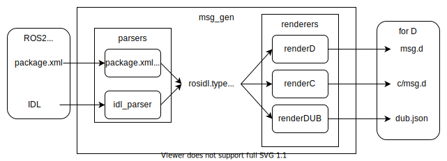

# msg_gen



This is a generator that reads `AMENT_PREFIX_PATH` environment variable set by ROS2 and creates D binding packages of messages.

Example

```shell
dub run ros2_d:msg_gen -- <output_dir>

# help
dub run ros2_d:msg_gen -- --help
```

The rule of generating D binding is the follows.

- Search `share` subdirectory of pathes defined in `AMENT_PREFIX_PATH`
- Select `rosidl_interface_packages` packages only
- DUB package name: Package name in `package.xml`
- DUB package version: Package version in `package.xml`
- msg definitions: To `source/<pkg_name>/msg.d` for all
    - C interface: To `source/<pkg_name>/c/msg.d` for all
- srv definitions: To `source/<pkg_name>/srv.d` for all (TBD)
- action definitions: To `source/<pkg_name>/action.d` for all(TBD)
